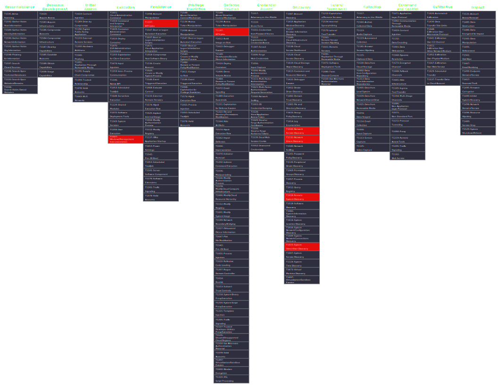
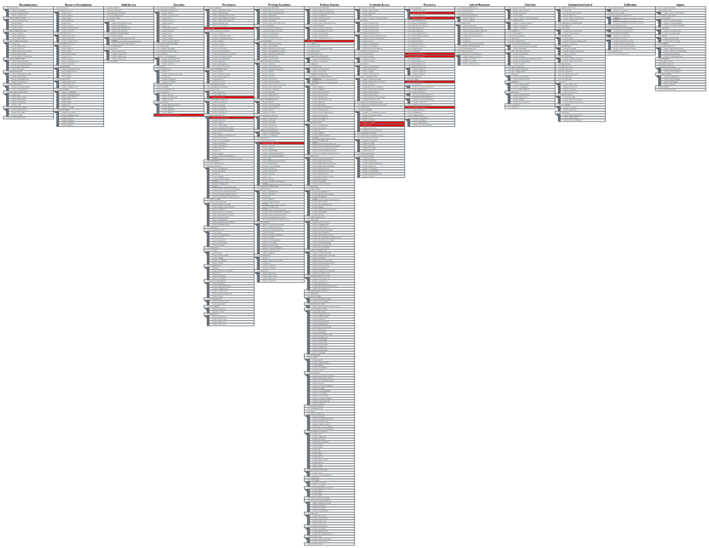

# ART-Gallery

## Overview
**ART-Gallery** is a hobby project designed to test and validate [Atomic Red Team](https://github.com/redcanaryco/atomic-red-team) detections for various threat actors using the MITRE ATT&CK framework. The repository simulates adversary techniques to help cybersecurity enthusiasts explore and validate detection capabilities in a controlled environment. Currently, it focuses on APT41 (aka Winnti Group), a sophisticated threat actor known for espionage and financially motivated attacks.

The project includes automated scripts to run Atomic Red Team tests, a MITRE ATT&CK Navigator layer to visualize techniques, and a screenshot for reference. This is a personal sandbox for experimenting with ATT&CK-based simulations and improving detection engineering skills.

## Repository Structure:

*Example*

- **APT41/**: Folder dedicated to APT41 simulations.
  - `APT41.ps1`: PowerShell script to automate execution of APT41-related Atomic Red Team tests, displaying test IDs and names in a pipe-delimited table and optionally executing them.
  - `apt41_(g0096).json`: MITRE ATT&CK Navigator layer file mapping the APT41 techniques tested.
  - `APT41_G0096_Collapsed.svg`: Screenshot of the MITRE ATT&CK Navigator layer in collapsed view, summarizing techniques.
  - `APT41_G0096_Expanded.svg`: Screenshot of the MITRE ATT&CK Navigator layer in expanded view, showing detailed techniques.

## Atomic Tests Included
The following table lists the Atomic Red Team tests included for APT41, grouped by MITRE ATT&CK tactics. These tests are automated via `Get-AtomicTestInfo.ps1` and simulate techniques associated with APT41’s known behaviors.

| Tactic                        | Test ID           | Test Name                                        |
|-------------------------------|-------------------|--------------------------------------------------|
| **Execution**                 | T1047-1           | WMI Reconnaissance Users                         |
|                               | T1047-2           | WMI Reconnaissance Processes                     |
|                               | T1047-3           | WMI Reconnaissance Software                       |
|                               | T1047-4           | WMI Reconnaissance List Remote Services          |
|                               | T1047-5           | WMI Execute Local Process                         |
| **Persistence & Defense Evasion** | T1197-3        | Persist, Download, & Execute                     |
|                               | T1546.008-5       | Auto-start application on user logon              |
|                               | T1546.008-7       | Replace Magnify.exe (Magnifier binary) with cmd.exe |
|                               | T1546.008-8       | Replace Narrator.exe (Narrator binary) with cmd.exe |
|                               | T1136.001-8       | Create a new Windows admin user                   |
|                               | T1136.001-4       | Create a new user in a command prompt             |
| **Discovery**                 | T1087.001-9       | Enumerate all accounts via PowerShell (Local)     |
|                               | T1087.001-10      | Enumerate logged on users via CMD (Local)         |
|                               | T1087.002-17      | Wevtutil - Discover NTLM Users Remote             |
|                               | T1046-10          | Port-Scanning /24 Subnet with PowerShell          |
|                               | T1135-5           | Network Share Discovery PowerShell                |
|                               | T1018-5           | Remote System Discovery - arp                     |
|                               | T1033-1           | System Owner/User Discovery                       |
| **Credential Access**         | T1003.001-10      | Powershell Mimikatz                               |
|                               | T1003.001-13      | Dump LSASS.exe using lolbin rdrleakdiag.exe       |
|                               | T1003.003-7       | Create Volume Shadow Copy with Powershell         |

## Getting Started
1. **Clone the Repository**:
   ```bash
   git clone https://github.com/05t3/ART-Gallery.git
   ```
2. **Install Atomic Red Team**:
   - Follow the [Atomic Red Team installation guide](https://github.com/redcanaryco/atomic-red-team#installation).
   - Ensure the `Invoke-AtomicRedTeam` module is installed at `C:\AtomicRedTeam\invoke-atomicredteam\Invoke-AtomicRedTeam.psd1`.
3. **Run the APT41 Simulation**:
   - Open PowerShell as Administrator.
   - Navigate to the `APT41` folder and run:
     ```powershell
     .\APT41.ps1
     ```
   - Review the table of tests, then enter `Y` to execute them or `N` to exit.
4. **Visualize Techniques**:
   - Open `apt41_(g0096).json` in the [MITRE ATT&CK Navigator](https://mitre-attack.github.io/attack-navigator/) to view the mapped techniques.
   - Check `apt41-navigator-screenshot.png` for a quick visual reference.

## Mapped Techniques






## Usage Notes
- **Environment**: Run in a controlled, isolated environment (e.g., a virtual machine) to avoid unintended system changes. Tests like `T1136.001-8` (Create a new Windows admin user), `T1546.008-7` (Replace Magnify.exe), and `T1003.001-10` (Powershell Mimikatz) may modify system configurations or require specific tools.
- **Customization**: Modify `APT41.ps1` to add or remove tests, adjust the order, or include additional threat actors.
- **Safety**: Ensure proper permissions and dependencies (e.g., Atomic Red Team YAML files in `C:\AtomicRedTeam\atomics`) are in place before running tests.

## Future Plans
- Expand to include simulations for other threat actors (e.g., APT29, APT28).
- Add more Atomic Red Team tests and corresponding MITRE ATT&CK Navigator layers.
- Enhance automation with logging or integration with detection tools.

## Contributing
This is a hobby project, but contributions are welcome! Submit issues or pull requests to add new threat actor simulations, improve scripts, or enhance documentation.

## License
This project is licensed under the MIT License. See the [LICENSE](LICENSE) file for details.

## Acknowledgments
- [Atomic Red Team](https://github.com/redcanaryco/atomic-red-team) for open-source ATT&CK test cases.
- [MITRE ATT&CK Navigator](https://mitre-attack.github.io/attack-navigator/) for technique visualization.

